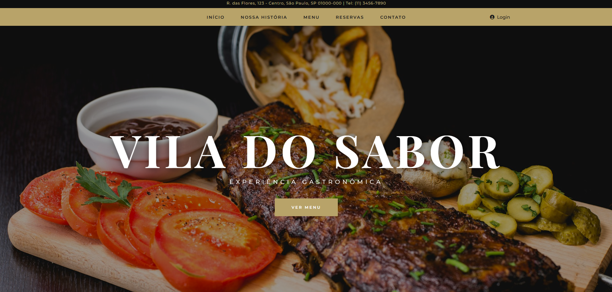
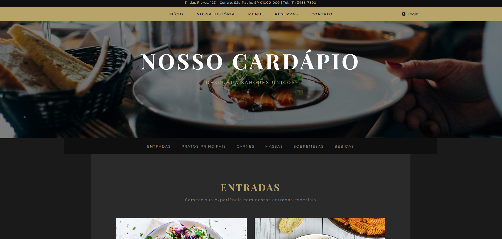
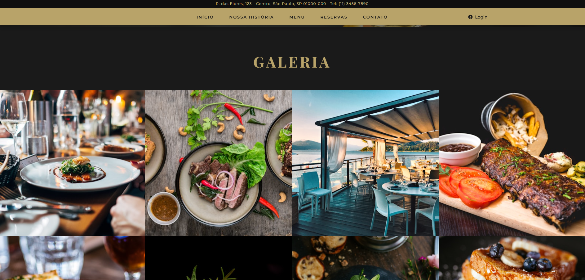

# 🍽️ Vila do Sabor — Restaurante & Bar

> Site fictício de restaurante desenvolvido como projeto individual no curso do **Senac**, aprimorado com auxílio de inteligência artificial.

---

## 📌 Sobre o Projeto

O **Vila do Sabor** é um site fictício criado para simular a presença digital de um restaurante sofisticado. O projeto foi desenvolvido individualmente como atividade avaliativa do curso no **Senac**, e posteriormente aprimorado com o suporte de IA para elevar a qualidade visual, a estrutura do código e a experiência de navegação.

O site apresenta todas as seções típicas de um restaurante real — apresentação da casa, cardápio completo, reservas, galeria, bar e contato. O **login é somente visual**: a interface existe na navegação, mas não há backend ou autenticação implementados.

---

## 🖼️ Preview

**Hero — Tela Inicial**


**Cardápio**


**Galeria**



---

## 🚀 Tecnologias Utilizadas

| Tecnologia | Função |
|---|---|
| HTML5 | Estrutura das páginas |
| CSS3 | Estilização, animações e responsividade |
| JavaScript (Vanilla) | Interatividade e comportamentos dinâmicos |
| [Font Awesome 6](https://fontawesome.com/) | Ícones |
| [Google Fonts](https://fonts.google.com/) | Tipografia — Playfair Display + Montserrat |
| [Unsplash](https://unsplash.com/) | Imagens via CDN |

---

## 📁 Estrutura do Projeto

```
vila-do-sabor/
├── index.html     # Página principal
├── menu.html      # Página do cardápio
└── README.md
└── docs/
    └── images/    → screenshots para este README
```

---

## ✨ Funcionalidades

- Header fixo com top bar e menu responsivo (mobile)
- Hero section em tela cheia com imagem de fundo
- Seção "Nossa História" com cards animados ao scroll
- Sistema de reservas com data, horário e número de pessoas
- Parallax nas seções de destaque e bar
- Galeria com lightbox interativo
- Seção newsletter com vídeo de fundo
- Formulário de contato com mapa integrado
- Página de menu com navegação por categorias (Entradas, Principais, Carnes, Massas, Sobremesas, Bebidas)
- Login — apenas interface visual, sem backend
- Layout responsivo para mobile, tablet e desktop

---

## ⚙️ Como Rodar

Nenhuma dependência de build é necessária.

```bash
# Abrir direto no navegador
Dê duplo clique em index.html

# Ou com servidor local (recomendado)
npx serve .
```

---

## ⚠️ Observações

- O **login** é apenas um elemento de interface — sem autenticação real.
- Os **formulários** (contato e newsletter) exibem alertas simulados, sem envio de dados.
- O **sistema de reservas** é visual — sem integração com banco de dados.
- O **vídeo de fundo** da newsletter usa fonte externa (Pexels); caso não carregue, uma imagem de fallback é exibida.

---


*© 2026 Vila do Sabor — Jhonatan Pedro*

---

## 📄 Licença

Este projeto está licenciado sob a licença MIT. Veja o arquivo [LICENSE](./LICENSE) para mais detalhes.
